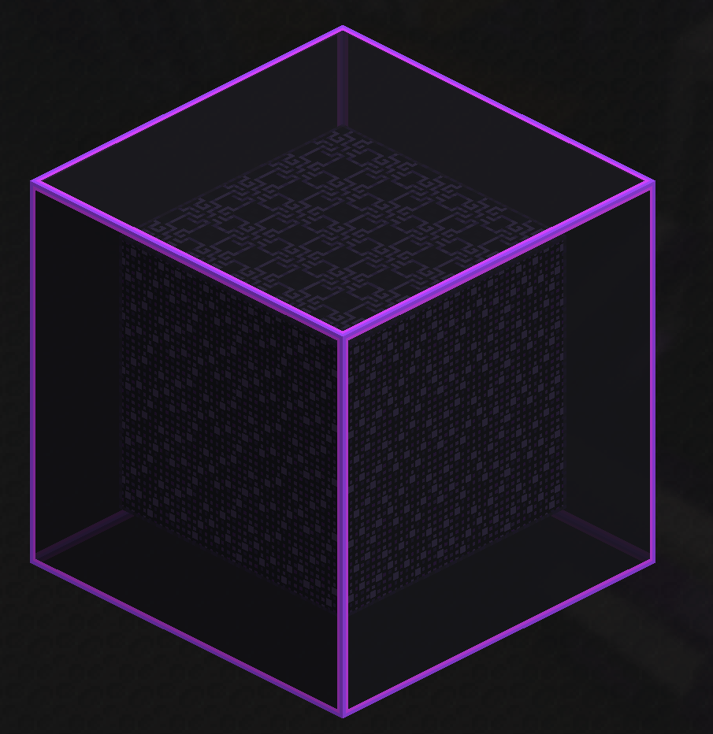
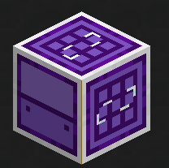
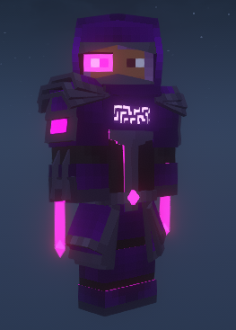
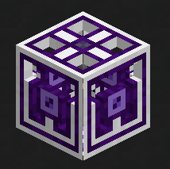
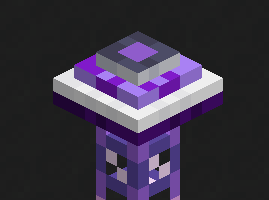
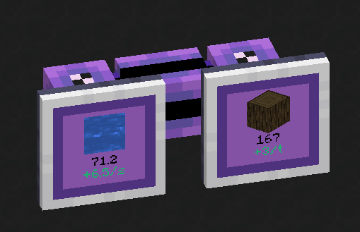

 

# Advanced AE!

Advanced AE focuses on convenience and improving user experience when handling your ME System.

## Features

### Advanced Pattern Providers

By utilizing an Advanced Pattern Encoder, you can modify Processing Patterns to select to which face each input will be sent, eliminating the need for multiple pipes and used sides to interact with machines that require them.

### Quantum Computer

Quantum Computer is a special type of Crafting Unit. It is capable of running an unlimited amount of crafting tasks, as long as it has enough crafting storage.
Furthermore, all of these concurrent tasks are able to share all co-processors present in the Quantum Computer Multiblock!
The Quantum Core can be used as a standalone crafting unit with 256M storage and 8 co-processors. By creating a multiblock with one of them, you can extend those capabilities by a large amount.
Specially when using two special block types: The Quantum Data Entangler and the Quantum Multi-Threader, which multiply storage and co-processors present in the multiblock by 4, respectively.
The multiblock can be scaled up to a 5x5x5, and consumes a single channel for all of this computing power!

### Quantum Crafter

A very powerful auto crafter that can perform a series of crafting operations every tick while accessing the ME System's
inventory directly. It is also capable of doing recursive crafting (like smithing templates) and multiple crafts that
require a non-consumed ingredient (Like Mystical Agriculture's essence upgrading). It can be configured to keep stacks
of the ingredients to avoid consuming all of it, or limit the end product, to keep an amount in stock.

### Quantum Armor Set

An armor set capable of connecting to the ME System to harness its resources for various quality of life functionality.
It is also very powerful defensively and includes various quality of life upgrades, like flight with no inertia,
night vision, magnet, auto feeding directly from ME Storage, immunity to various damage sources, and much more!

* Special thanks to Jm3 for the base models and textures

### Reaction Chamber

The reaction chamber is a machine that uses a ton of power to provide very efficient ways of processing materials. It is
used in the creation of various items needed to progress in AdvancedAE as well as offering efficient recipes for other mods.

### Stock Export Bus

An Export bus that reads the contents of the target inventory and regulates an exact amount to be kept in it at all times,
provided that the ME system has them available. It accepts a crafting card, enabling the export bus to craft the items
needed.

### ME Throughput Monitor

A special monitor that can be used to keep a close watch on the development of resources on your system. It can track
items, fluids and even energy in FE Cells (from AppliedFlux). To set it to track fluids or energy, right click with a
container with the desired ingredient twice. You can also configure the scale by using the Throughput Monitor Configurator.
Right-clicking a monitor with it will cycle between the options of "per tick", "per second" and "per minute".

Found a bug? Missing a feature?

[Create an Issue!](https://github.com/pedroksl/AdvancedAE/issues)

