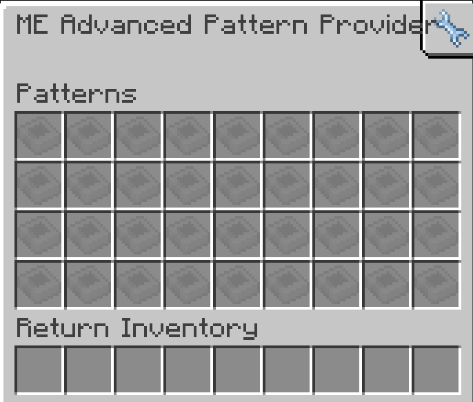

---
navigation:
  parent: aae_intro/aae_intro-index.md
  title: Proveedor de patrones avanzado
  icon: advanced_ae:adv_pattern_provider
categories:
  - advanced devices
item_ids:
  - advanced_ae:adv_pattern_provider
  - advanced_ae:small_adv_pattern_provider
  - advanced_ae:adv_pattern_provider_part
  - advanced_ae:small_adv_pattern_provider_part
---

# Proveedor de patrones avanzado

<Row gap="20">
<BlockImage id="advanced_ae:adv_pattern_provider" scale="8"></BlockImage>
<BlockImage id="advanced_ae:adv_pattern_provider" p:push_direction="up" scale="8"></BlockImage>
<GameScene zoom="8" background="transparent">
  <ImportStructure src="../structure/cable_app_part.snbt"></ImportStructure>
</GameScene>
</Row>

El <ItemLink id="advanced_ae:adv_pattern_provider" /> es un nuevo tipo de <ItemLink id="ae2:pattern_provider" /> que mejora
una versión estándar o un <ItemLink id="expatternprovider:ex_pattern_provider" /> con la capacidad de configurar la cara a
la que se empujará cualquier objeto individual en un patrón. Esta poderosa adición permite la automatización de máquinas que
requieren lados específicos para entradas específicas con un solo bloque y sin tuberías.

*Te estoy mirando a ti, Mekanism.*

Para poder usar esta función, necesitarás insertar un <ItemLink id="advanced_ae:adv_processing_pattern" /> creado
insertando un patrón codificado en un <ItemLink id="advanced_ae:adv_pattern_encoder" /> y sacando la versión avanzada.