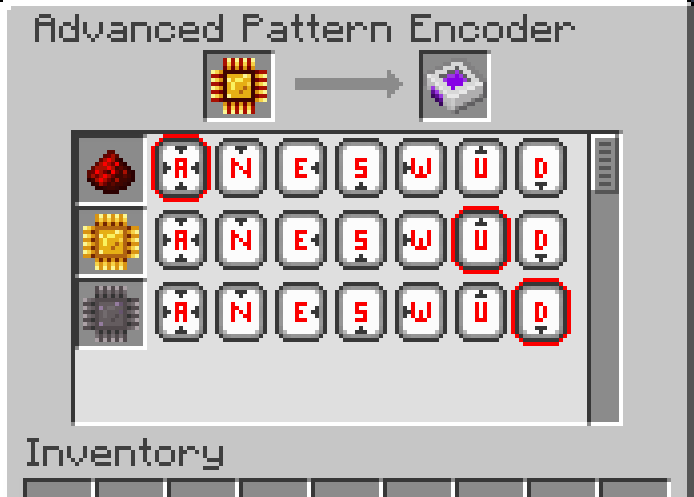

---
navigation:
  parent: aae_intro/aae_intro-index.md
  title: Codificador de patrones avanzado
  icon: advanced_ae:adv_pattern_encoder
categories:
  - advanced items
item_ids:
  - advanced_ae:adv_pattern_encoder
  - advanced_ae:adv_processing_pattern
---

# Codificador de patrones avanzado

Para indicar al <ItemLink id="advanced_ae:adv_pattern_provider" /> dónde enviar tus objetos, se necesita un dispositivo especial para codificar esa
información. Puedes usar un clic derecho con él en la mano para abrir su interfaz gráfica.

<ItemImage id="advanced_ae:adv_pattern_encoder" scale="4"></ItemImage>

Los patrones de procesamiento codificados se pueden insertar en la ranura izquierda, que se decodificará y todos los ingredientes
sin procesar se mostrarán en una lista.

Cada fila contiene un conjunto de botones que representan todas las caras posibles del bloque a las que se puede enviar el ingrediente.
Dejar la selección en el botón "A" enviará el ingrediente a la cara que esté directamente conectada al
proveedor de patrones, mientras que elegir una cara específica forzará que sea a esa cara donde se insertarán los objetos. Es importante
tener en cuenta que los patrones avanzados solo pueden ser decodificados correctamente por el <ItemLink id="advanced_ae:adv_pattern_provider" /> y
se comportarán como un patrón normal si se usan en otros tipos de proveedor de patrones.
Además, si un solo objeto no puede ser insertado en la cara especificada, no se insertarán objetos de forma direccional y
se aplicará el comportamiento estándar del proveedor de patrones.