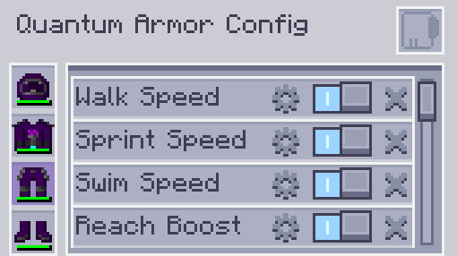

---
navigation:
  parent: aae_intro/aae_intro-index.md
  title: Conjunto de armadura cuántica
  icon: advanced_ae:quantum_helmet
categories:
  - advanced items
item_ids:
  - advanced_ae:quantum_helmet
  - advanced_ae:quantum_chestplate
  - advanced_ae:quantum_leggings
  - advanced_ae:quantum_boots
  - advanced_ae:quantum_upgrade_base
  - advanced_ae:walk_speed_card
  - advanced_ae:sprint_speed_card
  - advanced_ae:step_assist_card
  - advanced_ae:jump_height_card
  - advanced_ae:lava_immunity_card
  - advanced_ae:flight_card
  - advanced_ae:water_breathing_card
  - advanced_ae:auto_feeding_card
  - advanced_ae:auto_stock_card
  - advanced_ae:magnet_card
  - advanced_ae:hp_buffer_card
  - advanced_ae:evasion_card
  - advanced_ae:regeneration_card
  - advanced_ae:strength_card
  - advanced_ae:attack_speed_card
  - advanced_ae:luck_card
  - advanced_ae:reach_card
  - advanced_ae:swim_speed_card
  - advanced_ae:night_vision_card
  - advanced_ae:flight_drift_card
  - advanced_ae:recharging_card
  - advanced_ae:portable_workbench_card
  - advanced_ae:pick_craft_card
---

# Conjunto de armadura cuántica

<Row gap="10">
<ItemImage id="advanced_ae:quantum_helmet" scale="4"></ItemImage>
<ItemImage id="advanced_ae:quantum_chestplate" scale="4"></ItemImage>
<ItemImage id="advanced_ae:quantum_leggings" scale="4"></ItemImage>
<ItemImage id="advanced_ae:quantum_boots" scale="4"></ItemImage>
</Row>

* <ItemLink id="advanced_ae:quantum_helmet" />
* <ItemLink id="advanced_ae:quantum_chestplate" />
* <ItemLink id="advanced_ae:quantum_leggings" />
* <ItemLink id="advanced_ae:quantum_boots" />

¿Alguna vez te has preguntado cómo sería llevar puesto tu sistema AE? Bueno, ya no tienes que preguntártelo más. ¡El conjunto
de armadura cuántica es una prenda sigilosa y altamente tecnológica que se conecta al sistema AE2 para proporcionar un acceso
conveniente a todo en cualquier lugar! Por defecto, es un traje alimentado por energía con defensas comparables a las del equipo de
netherita. Es capaz de usar su reserva para crear un escudo de energía, proporcionando una cantidad saludable de absorción de daño.
Las botas también proporcionan negación de daño de caída, mientras que la pechera puede eliminar las penalizaciones de minería en vuelo.
¡Sin embargo, el verdadero poder de este traje solo se desbloquea cuando lo llenas de mejoras!

 

## Vinculación de la armadura

Las piezas de armadura se pueden vincular individualmente al sistema insertándolas en las ranuras apropiadas de un
<ItemLink id="ae2:wireless_access_point" />. Esto desbloquea diferentes ventajas según la pieza de equipo y las tarjetas de mejora
instaladas. Más sobre eso más adelante. Ten en cuenta que para que estas funcionalidades adicionales funcionen correctamente, también debes estar
dentro del alcance del punto de acceso conectado.

 

## Instalación de mejoras

Para instalar mejoras, debes tener las piezas equipadas y luego abrir el menú de configuración de la armadura cuántica,
presionando la tecla de acceso rápido (N por defecto).

En esta pantalla podrás agregar/eliminar mejoras, así como activarlas/desactivarlas y configurar los ajustes de las
mejoras que las tienen.

 

## Tarjeta base de mejora cuántica

<ItemImage id="advanced_ae:quantum_upgrade_base" scale="2"></ItemImage>

La <ItemLink id="advanced_ae:quantum_upgrade_base" /> no hace nada especial por sí sola, pero se utiliza como un
ingrediente de fabricación para todas las tarjetas de mejora.

 

## Tarjeta de alimentación automática

<ItemImage id="advanced_ae:auto_feeding_card" scale="2"></ItemImage>

La <ItemLink id="advanced_ae:auto_feeding_card" /> permite la selección de objetos específicos para alimentar al jugador.
Simplemente arrastra los objetos deseados a las ranuras de filtro y si el equipo está vinculado a la cuadrícula AE2,
intentará encontrarlos en el sistema para alimentar al jugador cuando tenga hambre.

 

## Tarjeta de stock automático

<ItemImage id="advanced_ae:auto_stock_card" scale="2"></ItemImage>

La <ItemLink id="advanced_ae:auto_stock_card" /> también requiere que la pieza de equipo esté vinculada al sistema AE2 y
el rango adecuado al punto de acceso. Permite la configuración de algunos stacks para que siempre se mantengan en cantidades
específicas en el inventario del usuario. Las ranuras no están limitadas a un stack, por lo que puedes configurarlas para que
tengan más de una ranura llena en el inventario en todo momento si así lo deseas.

 

## Tarjetas de velocidad

<Row gap="10">
<ItemImage id="advanced_ae:walk_speed_card" scale="2"></ItemImage>
<ItemImage id="advanced_ae:sprint_speed_card" scale="2"></ItemImage>
<ItemImage id="advanced_ae:swim_speed_card" scale="2"></ItemImage>
</Row>

* <ItemLink id="advanced_ae:walk_speed_card" />
* <ItemLink id="advanced_ae:sprint_speed_card" />
* <ItemLink id="advanced_ae:swim_speed_card" />

Estas tarjetas de mejora mejoran la velocidad de movimiento del usuario del conjunto. Todas tienen valores configurables para la velocidad
deseada y también afectan el movimiento mientras se agacha y vuela. Es importante tener en cuenta que estas mejoras también se pueden usar para
disminuir la velocidad para permitir un mayor control cuando hay otros efectos de aumento de velocidad en juego.

 

## Tarjetas de altura

<Row gap="10">
<ItemImage id="advanced_ae:jump_height_card" scale="2"></ItemImage>
<ItemImage id="advanced_ae:step_assist_card" scale="2"></ItemImage>
</Row>

* <ItemLink id="advanced_ae:jump_height_card" />
* <ItemLink id="advanced_ae:step_assist_card" />

Estas mejoras cambian el movimiento vertical, permitiendo alturas de salto más altas configurables o asistencia de paso.

 

## Tarjetas de vuelo

<Row gap="10">
<ItemImage id="advanced_ae:flight_card" scale="2"></ItemImage>
<ItemImage id="advanced_ae:flight_drift_card" scale="2"></ItemImage>
</Row>

### Tarjeta de vuelo

La <ItemLink id="advanced_ae:flight_card" /> habilita el vuelo creativo cuando está instalada. La velocidad de vuelo se puede configurar
usando el control deslizante en la interfaz de usuario. También se ve afectada por las mejoras de velocidad al caminar/correr de forma aditiva.

### Tarjeta de drift de vuelo

La <ItemLink id="advanced_ae:flight_drift_card" /> solo funciona cuando la <ItemLink id="advanced_ae:flight_card" /> está instalada y agrega otro
control deslizante de configuración para cambiar la inercia que afecta el vuelo creativo. Los valores más bajos hacen que te detengas más rápido, deteniéndote
instantáneamente cuando el valor se establece en 0.

 

## Tarjeta de recarga ME

<ItemImage id="advanced_ae:recharging_card" scale="2"></ItemImage>

La <ItemLink id="advanced_ae:recharging_card" /> habilita la recarga inalámbrica para la pieza equipada. Esto requiere un
enlace a la cuadrícula y estar dentro del alcance del punto de acceso. Instalar esta mejora en la pechera tiene el beneficio adicional
de también cargar las ranuras del inventario.

 

## Tarjeta de banco de trabajo portátil

<ItemImage id="advanced_ae:portable_workbench_card" scale="2"></ItemImage>

La <ItemLink id="advanced_ae:portable_workbench_card" /> agrega un banco de trabajo portátil al traje cuántico. Para abrirlo,
debes presionar la tecla de acceso rápido configurada. Funciona de la misma manera que la forma de bloque.

 

## Tarjeta de fabricación rápida

<ItemImage id="advanced_ae:pick_craft_card" scale="2"></ItemImage>

La <ItemLink id="advanced_ae:pick_craft_card" /> agrega una nueva función de tecla de acceso rápido a la armadura. Al presionarla, intentará
fabricar el bloque que el jugador está apuntando actualmente. Esta función requiere un enlace a la cuadrícula y un patrón
que coincida con el objetivo. Aparecerá una ventana emergente que requerirá la cantidad deseada y el proceso sigue exactamente igual que una
solicitud de fabricación automática normal.

 

## Tarjetas de utilidades

<Row gap="10">
<ItemImage id="advanced_ae:night_vision_card" scale="2"></ItemImage>
<ItemImage id="advanced_ae:lava_immunity_card" scale="2"></ItemImage>
<ItemImage id="advanced_ae:water_breathing_card" scale="2"></ItemImage>
<ItemImage id="advanced_ae:magnet_card" scale="2"></ItemImage>
</Row>

* <ItemLink id="advanced_ae:night_vision_card" />
* <ItemLink id="advanced_ae:lava_immunity_card" />
* <ItemLink id="advanced_ae:water_breathing_card" />
* <ItemLink id="advanced_ae:magnet_card" />

Estas tarjetas proporcionan varias utilidades para el usuario del conjunto, brindando inmunidad a algunos tipos de daño y otorgando visión
nocturna. La tarjeta de imán, en particular, tiene una pantalla de configuración donde puedes establecer filtros para lo que deseas recoger o no
y para configurar su alcance.

 

## Tarjetas defensivas

<Row gap="10">
<ItemImage id="advanced_ae:hp_buffer_card" scale="2"></ItemImage>
<ItemImage id="advanced_ae:regeneration_card" scale="2"></ItemImage>
<ItemImage id="advanced_ae:evasion_card" scale="2"></ItemImage>
</Row>

* <ItemLink id="advanced_ae:hp_buffer_card" />
* <ItemLink id="advanced_ae:regeneration_card" />
* <ItemLink id="advanced_ae:evasion_card" />

Estas mejoras proporcionan beneficios defensivos al usuario del conjunto, en varias formas. La tarjeta de salud aumentará la salud
máxima, mientras que la tarjeta de regeneración aumentará la velocidad a la que se recupera. La tarjeta de evasión proporciona inmunidad
total a cualquier fuente de daño con una cierta probabilidad.

 

## Tarjetas ofensivas

<Row gap="10">
<ItemImage id="advanced_ae:strength_card" scale="2"></ItemImage>
<ItemImage id="advanced_ae:attack_speed_card" scale="2"></ItemImage>
</Row>

* <ItemLink id="advanced_ae:strength_card" />
* <ItemLink id="advanced_ae:attack_speed_card" />

Estas mejoras aumentan las capacidades ofensivas del usuario del conjunto. Proporcionan un aumento al daño de ataque y a la velocidad de ataque.

 

## Tarjetas de estadísticas

<Row gap="10">
<ItemImage id="advanced_ae:luck_card" scale="2"></ItemImage>
<ItemImage id="advanced_ae:reach_card" scale="2"></ItemImage>
</Row>

* <ItemLink id="advanced_ae:luck_card" />
* <ItemLink id="advanced_ae:reach_card" />

Estas tarjetas de mejora proporcionan aumentos de estadísticas planas al usuario, afectando la suerte para mejores tiradas
de botín y la distancia de alcance de bloques. La tarjeta de alcance se puede configurar a un valor específico deseado.

 

## Más por venir

¡Este conjunto de equipo se lanzó como una línea base con muchas otras características planeadas para su lanzamiento, así que mantente atento!