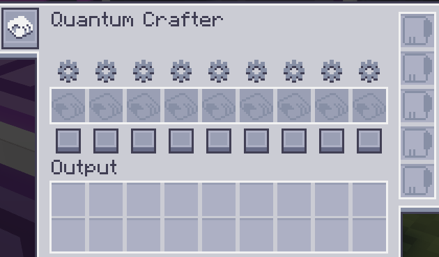
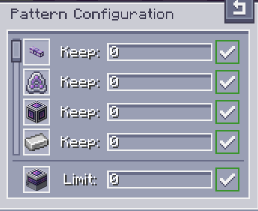

---
navigation:
  parent: aae_intro/aae_intro-index.md
  title: Fabricador cuántico
  icon: advanced_ae:quantum_crafter
categories:
  - advanced devices
item_ids:
  - advanced_ae:quantum_crafter
---

# Fabricador cuántico

<BlockImage id="advanced_ae:quantum_crafter" p:working="true" scale="4"></BlockImage>

El <ItemLink id="advanced_ae:quantum_crafter" /> es un auto-fabricador potente y configurable. Con todo el inventario de los sistemas AE a su
alcance, fabricar sin parar se convierte en una tarea trivial. Es capaz de ejecutar trabajos de fabricación a un ritmo muy rápido mientras se
asegura de que nunca te quedes sin recursos cruciales. También es capaz de ejecutar artesanías de sustitución de fluidos, así como
fabricaciones recursivas, que tienen una entrada como salida.

## Uso del fabricador

Para utilizar el fabricador cuántico, debes colocarlo en tu red y conectarlo con un cable. Se requiere un solo canal
para su funcionamiento. Selecciona qué recetas quieres que se ejecuten indefinidamente y codifícalas en un patrón de fabricación.
Esos patrones pueden insertarse en las ranuras apropiadas del fabricador.

Una vez insertados, hay dos botones que permiten configurar cada patrón. El botón cuadrado en la parte inferior es
responsable de habilitar/deshabilitar un patrón. Los patrones deshabilitados nunca se fabricarán, pero los patrones habilitados aún siguen
un conjunto de condiciones. Para establecer estas condiciones, debes hacer clic en el botón de engranaje para abrir la interfaz de configuración del patrón.

Dentro de la interfaz de configuración del patrón se muestran todos los ingredientes y el resultado principal. Puedes usar los campos numéricos para
indicar cuánto de cada ingrediente deseas mantener en el sistema ME en todo momento, así como establecer una cantidad máxima
del producto final, para evitar la fabricación en exceso de objetos costosos. Después de escribir el número deseado (también se aceptan
expresiones matemáticas), debes presionar enter para aplicar el valor. Una indicación en el lado derecho mostrará si
los valores fueron aplicados correctamente o no. En particular, al configurar el límite del resultado, si se establece en 0,
el límite se elimina y la fabricación continuará hasta que se agoten los ingredientes.

## Salidas

La salida de las fabricaciones realizadas por el fabricador cuántico es altamente configurable. La configuración predeterminada intentará
empujar los objetos directamente desde las ranuras de salida al sistema ME. Al hacer clic izquierdo en el botón de celda en la barra de herramientas izquierda, la
salida puede configurarse para ser enviada a inventarios adyacentes en su lugar. Esto es aún más configurable haciendo clic en el otro
botón que aparece cuando esta configuración está habilitada, que permite seleccionar qué lados se considerarán
habilitados para la exportación automática. La combinación de estas dos configuraciones debería permitir un gran control y opciones creativas
sobre cómo se utiliza el fabricador.

## Mejoras

Para desbloquear todo el potencial del fabricador cuántico, se deben instalar tarjetas de mejora. Puede recibir
<ItemLink id="ae2:speed_card" />s y <ItemLink id="ae2:redstone_card" />s. La primera acelera enormemente la velocidad de fabricación,
alcanzando 64 fabricaciones de cada patrón por tick, mientras que la segunda permite el control por redstone.