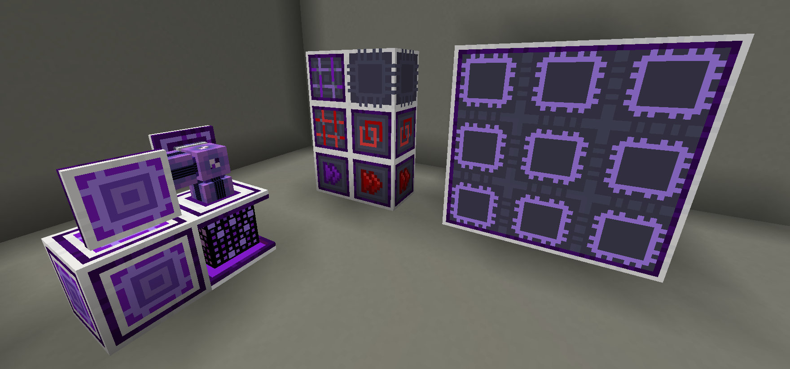

---
navigation:
  title: Introducción a Advanced AE
  position: 70
---

# ¡Advanced AE!

Advanced AE se centra en mejorar la experiencia del usuario al manejar tu sistema ME y en expandir las posibilidades de
los sistemas end-game. ¡Este mod te permite mejorar los proveedores de patrones con la capacidad de enviar objetos a lados específicos
de las máquinas objetivo y crear computadoras multibloque que pueden ejecutar una cantidad ilimitada de fabricaciones, compartiendo
coprocesadores, siempre que quede almacenamiento de fabricación disponible, además de un montón de otras mejoras de calidad de vida!

Para una lista completa de los bloques y objetos incluidos, consulta estas páginas de la guía:

## Dispositivos avanzados

<CategoryIndex category="advanced devices"></CategoryIndex>

## Objetos avanzados

<CategoryIndex category="advanced items"></CategoryIndex>

¿Encontraste un problema? ¿Falta alguna característica?
Por favor, repórtalo aquí:
[Advanced AE GitHub](https://github.com/pedroksl/AdvancedAE)